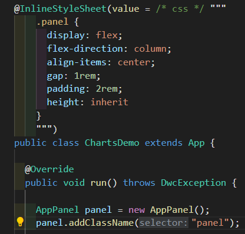

# Vscode Java HTML

Adds syntax highlight support for HTML & CSS placed in java text blocks:

## Installation

- Install `vscode-java-html` from extensions (`ctrl + shift + x`)

## Example

## Usage

Simply insert 

1. The comment `/*css*/`, `/*inline-css*/` before a CSS text block.
2. The comment `/*html*/`, `/*inline-html*/` before a HTML text block.